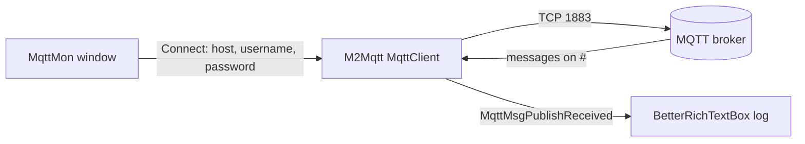

# MqttMon

MqttMon is a small Windows desktop app (C#, WinForms, .NET Framework) that connects to an MQTT
broker, subscribes to every topic, and shows each message in a live, colour-coded log. It is
meant as a quick way to see what is going through your broker when you set up or debug MQTT
devices and home-automation integrations.

## Table of contents

- [Features](#features)
- [Screenshots](#screenshots)
- [How it works](#how-it-works)
- [Requirements](#requirements)
- [Installation](#installation)
- [Usage](#usage)
- [Settings](#settings)
- [Troubleshooting](#troubleshooting)
- [Security notes](#security-notes)
- [Known issues and limitations](#known-issues-and-limitations)
- [Development](#development)
- [Contributing](#contributing)
- [License](#license)

## Features

- Connects to an MQTT broker using a server address, username and password.
- Subscribes to all topics (`#`) as soon as the connection is up.
- Shows every received message in a black console-style log:
  - `Topic Received: <topic>` in green
  - `Data Received: <payload>` in white
- Status and error messages in colour: yellow while connecting or disconnecting, green when
  connected, red for errors and missing fields.
- The log auto-scrolls while you are at the bottom. If you scroll up to read older messages,
  new messages don't pull the view down.
- **Connect** / **Disconnect** buttons, with only the relevant one enabled.
- **Clear Log** button to empty the log.
- The password field is masked.
- Disconnects cleanly when you close the window.

## Screenshots

<!-- TODO: screenshot -->

## How it works



- The MQTT client is [M2Mqtt](https://www.nuget.org/packages/M2Mqtt/) (Eclipse Paho .NET
  client), version **4.3.0.0**, from NuGet (`packages.config`).
- On **Connect**, MqttMon creates an `MqttClient` for the host you entered, using the library's
  default port (**1883**, plain TCP) and protocol (MQTT 3.1.1), then connects with your username
  and password.
- It then subscribes to two topic filters:

  | Topic filter | QoS |
  |---|---|
  | `#` (all topics) | 2 (exactly once) |
  | `w` | 1 (at least once) |

  `#` already matches everything, so the extra `w` subscription adds nothing you would notice.
- Payloads are decoded as text with the Windows default (ANSI) code page (`Encoding.Default`).
- The log is a custom `RichTextBox` (`Controls/BetterRichTextBox.cs`) that appends coloured
  lines in a thread-safe way and uses Win32 calls (`user32.dll`) to handle auto-scrolling.

## Requirements

- Windows (the app is WinForms and uses `user32.dll`).
- .NET Framework **4.5.2** or later (the project targets `v4.5.2`).
- An MQTT broker reachable on TCP port **1883** that accepts username/password authentication.

## Installation

There are no GitHub releases. You can use the installer that is committed to the repository, or
build from source.

### MSI installer

The repository contains a Visual Studio Installer project (`MqttMonSetup`) and its built output:

- [`MqttMonSetup/Debug/MqttMonSetup.msi`](MqttMonSetup/Debug/MqttMonSetup.msi)
- [`MqttMonSetup/Debug/setup.exe`](MqttMonSetup/Debug/setup.exe) (bootstrapper)

> **Caution:** these files are an **unsigned Debug build** committed to the repository in 2019.
> Windows SmartScreen will warn about them, and they may not match the current source. Build
> the app yourself if you want to be sure what you run.

The installer (product `MqttMon`, version 1.0.0, manufacturer Tomer Klein):

- installs `MqttMon.exe`, `MqttMon.exe.config` and `M2Mqtt.Net.dll` to
  `C:\Program Files\MqttMon` (`[ProgramFilesFolder]\MqttMon`);
- creates `MqttMon` shortcuts (desktop and Start menu);
- has a launch condition that asks for .NET Framework 4.6.1 with `AllowLaterVersions` set to
  false, while the app itself targets .NET Framework 4.5.2.

### Build from source

1. Install Visual Studio with the **.NET desktop development** workload and the .NET Framework
   4.5.2 targeting pack.
2. Clone the repository:
   ```bash
   git clone https://github.com/t0mer/MqttMon.git
   ```
3. Open `MqttMon.sln`. The NuGet packages are already in `packages/`; otherwise restore them
   (right-click the solution → **Restore NuGet Packages**).
4. Build the `MqttMon` project. The output is `MqttMon\bin\<Configuration>\MqttMon.exe`.
5. Optional: to build the MSI, install the
   [Microsoft Visual Studio Installer Projects](https://marketplace.visualstudio.com/items?itemName=VisualStudioClient.MicrosoftVisualStudio2017InstallerProjects)
   extension. Build `MqttMon` in the **Debug** configuration first, then build `MqttMonSetup`.
   The setup project hard-codes `..\MqttMon\bin\Debug\MqttMon.exe` and its `.config` as
   sources, so even a Release MSI packages the Debug exe. The output goes to
   `MqttMonSetup\Debug\MqttMonSetup.msi` or `MqttMonSetup\Release\MqttMonSetup.msi`.

## Usage

1. Start **MqttMon** (window title: *MqttMon - Monitor all your mqtt messages*).
2. Fill in the fields at the top:

   | Field | What to enter |
   |---|---|
   | **Server Address** | Broker host name or IP address only, e.g. `192.168.1.10`. Don't add a port or `mqtt://`: port 1883 is always used. |
   | **Username** | Broker username. Required. |
   | **Password** | Broker password (masked). Required. |

3. Click **Connect**. The log shows `Connecting To server` and then `Connected To server`.
4. Every message published on the broker now appears as a `Topic Received` / `Data Received`
   pair.
5. Click **Clear Log** to empty the log.
6. Click **Disconnect** to unsubscribe and close the connection. Closing the window also
   disconnects.

The UI has no fields for port, client ID, TLS, topic filter or QoS, and no publish panel.

## Settings

MqttMon doesn't save anything. `Properties/Settings.settings` has no settings and `App.config`
only declares the supported runtime, so you have to enter the server address, username and
password each time you start the app. Nothing is written to `user.config`.

Fixed values in the code:

| Value | Setting |
|---|---|
| Port | 1883 (M2Mqtt default) |
| Transport | Plain TCP, no TLS |
| Subscriptions | `#` at QoS 2, `w` at QoS 1 |
| Client ID | `00000000-0000-0000-0000-000000000000` (see [Known issues](#known-issues-and-limitations)) |
| Payload encoding | Windows default code page |

## Troubleshooting

| Message or symptom | Cause | Fix |
|---|---|---|
| `Please enter Server Address` / `Please enter Username` / `Please enter Password` | All three fields are required. | Fill in the field. Brokers that allow anonymous access still need some username and password in the form. |
| Red error text, then `unable to connect to the server, please check your connection settings` | The connection or login failed (wrong host, port 1883 blocked, wrong credentials, broker down). The first red line is the exception message from M2Mqtt. | Check the host, that the broker listens on 1883 without TLS, and the credentials. |
| An error dialog right after a failed connection | See the first item under [Known issues](#known-issues-and-limitations). | Close the dialog and try again, or restart the app. |
| A running MqttMon stops showing messages after a second instance connects (on this or another PC) | Every instance uses the same client ID, so the broker drops the first connection when the second one connects. The first instance doesn't notice and never reconnects. | Run one instance per broker. In the first instance, click **Disconnect** and **Connect** again. |
| Payload shows garbled characters | Payloads are decoded with the Windows default code page, not UTF-8. Binary payloads show up as noise. | None in the app. |
| The broker disconnects and the buttons don't change | The connection-closed event isn't handled. | Click **Disconnect** and **Connect** again, or restart the app. |

## Security notes

- The connection is **plain TCP on port 1883**. The username, password and all message payloads
  travel unencrypted. Use MqttMon only on a trusted network, or put the broker behind a VPN.
- MqttMon doesn't store the credentials: they stay in memory while the app runs.
- There are no hard-coded broker addresses or credentials in the source or config files.
- Use a broker account with read-only access if you can: MqttMon only needs to subscribe to `#`.
- The committed installer is an unsigned Debug build (see [Installation](#installation)).

## Known issues and limitations

- **A failed connection can crash the app.** When `Connect()` fails it sets the client to
  `null`, and `CheckState()` then reads `client.IsConnected`, which throws a
  `NullReferenceException`.
- **Fixed client ID.** The client ID comes from `new Guid().ToString()`, which is always
  the empty GUID. When a second MqttMon instance connects to the same broker, the broker drops
  the first one. The first instance doesn't notice and doesn't reconnect.
- **Save Log to File does nothing.** The button and a save dialog exist, but the click handler
  is empty.
- The log shows no timestamp, QoS or retain flag.
- Uneven line spacing (cosmetic). `BetterRichTextBox.AppendLine` skips the extra newline when
  it is called from a background thread, so received messages are single-spaced while status
  lines are double-spaced. Each received message is also followed by an empty green line.
- No port, TLS, client ID, topic filter, QoS or publish options.
- The connection-closed event isn't handled, so the UI doesn't notice when the broker drops
  the connection.
- The `MarkupConverter` package is listed in `packages.config` but not used by the project.

## Development

Project layout:

```
MqttMon.sln                     Solution (app + installer)
MqttMon/
  Program.cs                    Entry point, starts the main form
  MqttMon.cs                    Main form logic: connect, subscribe, log, buttons
  MqttMon.Designer.cs           WinForms layout
  Controls/BetterRichTextBox.cs Coloured, auto-scrolling log control
  App.config                    Supported runtime (.NET Framework 4.5.2)
  Properties/                   Assembly info, resources, (empty) settings
  packages.config               NuGet packages: M2Mqtt 4.3.0.0, MarkupConverter 1.0.5
  mqtt.ico                      Application icon
MqttMonSetup/
  MqttMonSetup.vdproj           Visual Studio Installer project
  Debug/                        Built MSI and setup.exe (unsigned Debug build)
packages/                       Restored NuGet packages
.nuget/                         NuGet.exe and package-restore targets
License                         Apache License 2.0
```

There are no tests and no CI.

## Contributing

Issues and pull requests are welcome. Keep changes small, describe what you changed and how you
tested it, and build the solution in Visual Studio before you open a pull request.

## License

MqttMon is licensed under the [Apache License 2.0](License).
